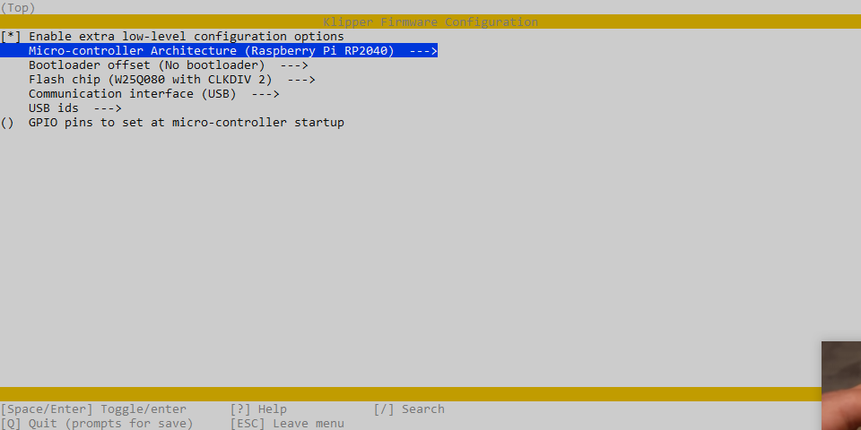

## V0 Display Flashing Instructions:

1) Connect to your host raspberry pi via SSH

2) This step depends on if your board has firmware on it or not already:

	a) If you have a pre-flashed board:
		- Connect the board to the host Raspberry Pi via USB
		- Jump to step 9
	
	b) If you have an unflashed board:
		- Hold the BOOT button **while** connecting to your Pi via USB
	

3) Run `lsusb` from the command prompt
	- Make sure you see a `Raspberry Pi RP2 Boot`
	
4) Run `cd ~/klipper` from the command line to enter the Klipper directory

5) Run `make menuconfig` settings should be:

	Exit and Save

6) Run `make clean` to clean up the make environment.

7) Run `make flash FLASH_DEVICE=2e8a:0003`

8) Remove the BOOT jumper

9) Now `ls /dev/serial/by-id/*` should return a device begining with `/dev/serial/by-id/usb-Klipper_rp2040...` 

10) Copy this serial port name (`/dev/serial/by-id/usb-Klipper_rp2040...` )and place it in your [mcu display] section of the display config file.

Your board should now be usable with Klipper. Use the example config file to get started
Best option is to copy the config file into the same directory as `printer.cfg` then add `[include V0Display.cfg]` to the end of your `printer.cfg` to include the file.
