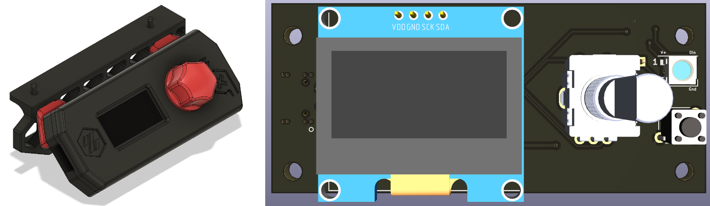

# RP2040 V0 Display #

[iBOM](http://htmlpreview.github.io/?https://github.com/Fisheiyy/RP2040_V0_Display/blob/master/KiCad/ibom.html)
### Derived from [Timmit99's V0 Display](https://github.com/VoronDesign/Voron-Hardware/tree/master/V0_Display)
### Sponsored by Provok3d.com & Lab4450.com

## The board has: ##
 - RP2040 MCU with 12MHz Crystal
 - SWD header for easy debugging (not populated by default)
 - USB C port
 - I2C Screen connections for  1.3" display with jumpers on back for slecting which pins (1 or 2) are power and ground
 - EN11-style click encoder support
 - Reset/kill button
 - 3 GPIO pin header
 - 1 on-board Neopixel with data line broken out for expansion